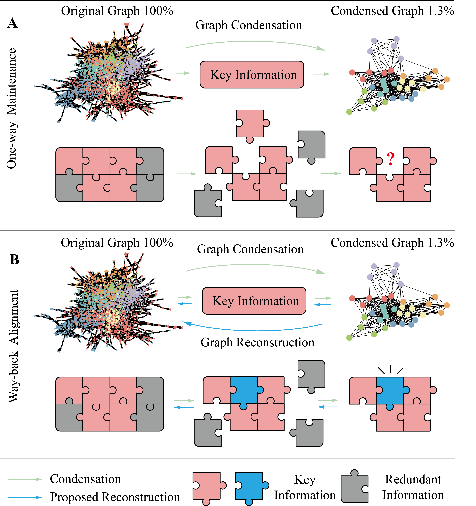

# WbGC
The PyTorch implementation for **Enhancing Graph Condensation via Key Information Reconstruction** is provided under the main directory. 

This repository references the PyTorch implementations of GC method provided by [SGDD](https://github.com/RingBDStack/SGDD) and [GCond](https://github.com/ChandlerBang/GCond).


Abstract
----
The continuous advancement of graph data mining techniques, particularly with the integration of Graph Neural Networks (GNNs), is enabling more complex analysis and applications. However, real-world graphs often comprising millions or billions of nodes and edges, present significant computational challenges. **Graph condensation (GC)** aims to synthesize smaller condensed graphs that maintain the key information of the original graphs, thereby fundamentally reducing the challenge of graph volume while maintaining the performance in downstream tasks. Recent advances in GC methods have showcased diverse definitions of key information in graphs, leading to unique maintenance processes for each method. Although numerous efforts have been made, the maintaining process of the key information may be insufficient for relying only on heuristic metrics for guidance. To bridge this gap, in this paper, **we aim to enhance the key information maintenance** from the perspective of information theory. More specifically, inspired by the Kolmogorov Complexity, we revisit the GC process and **propose a way-back mechanism that introduces a feedback loop of learning to reconstruct the original graph from the condensed graph, with the objective of key information alignment**, namely the **WbGC**. We modify several GC methods with our mechanism, and the experiments show that our approach provides an enhanced solution for GC, paving the way for more applications in diverse domains.


<div align=center></div>

**Fig. 1. Comparsions of the proposed WbGC (B) with existing GC methods (A), where a reconstruction mechanism has been leveraged to enhance the alignment of key information.**


## Requirements
Please see [requirements.txt](./requirements.txt).
```
torch==1.7.0
torch_geometric==1.6.3
scipy==1.6.2
numpy==1.19.2
ogb==1.3.0
tqdm==4.59.0
torch_sparse==0.6.9
deeprobust==0.2.4
scikit_learn==1.0.2
```

## Download Datasets
For cora, citeseer and pubmed, the code will directly download them;
For reddit, flickr and arxiv: they are available on [Google Drive link](https://drive.google.com/open?id=1zycmmDES39zVlbVCYs88JTJ1Wm5FbfLz) (alternatively, [BaiduYun link (code: f1ao)](https://pan.baidu.com/s/1SOb0SiSAXavwAcNqkttwcg)). Rename the folder to `data` at the root directory.


## Run the code
### Run GCond
For transductive setting, please run the following command:
```s
python train_gcond_transduct.py --dataset cora --nlayers=2 --lr_feat=1e-4 --gpu_id=0  --lr_adj=1e-4 --r=0.5  
```
For inductive setting, please run the following command:
```s
python train_gcond_induct.py --dataset flickr --nlayers=2 --lr_feat=0.01 --gpu_id=0  --lr_adj=0.01 --r=0.005 --epochs=1000  --outer=10 --inner=1
```
### Run GCond + Ours
For transductive setting, please run the following command:
```s
python train_gcond_transduct_recons.py --dataset cora --nlayers=2 --lr_feat=1e-4 --gpu_id=0  --lr_adj=1e-4 --r=0.5  
```
For inductive setting, please run the following command:
```s
python train_gcond_induct_recons.py --dataset flickr --nlayers=2 --lr_feat=0.01 --gpu_id=0  --lr_adj=0.01 --r=0.005 --epochs=1000  --outer=10 --inner=1
```


We follow the benchmark settings where `r` indicates the ratio of condensed samples to the labeled samples.
For instance, there are only 140 labeled nodes in Cora dataset, so `r=0.5` indicates the number of condensed samples are 70, **which corresponds to  r=2.6%=70/2710 in the paper**. Thus, the parameter `r` is different from the real reduction rate in the paper for the transductive setting, please see the following table for the correspondence.

|              | `r` in the code     | `r` in the paper  (real reduction rate)    |
|--------------|-------------------|---------------------|
| Transductive | Cora, r=0.5       | Cora, r=2.6%        |
| Transductive | Citeseer, r=0.5   | Citeseer, r=1.8%    |
| Transductive | Ogbn-arxiv, r= 0.005 | Ogbn-arxiv, r=0.25% |
| Transductive | Pubmed, r=0.5     | Pubmed, r=0.3%      |
| Inductive    | Flickr, r=0.01    | Flickr, r=1%        |
| Inductive    | Reddit, r=0.001   | Reddit, r=0.1%      |
